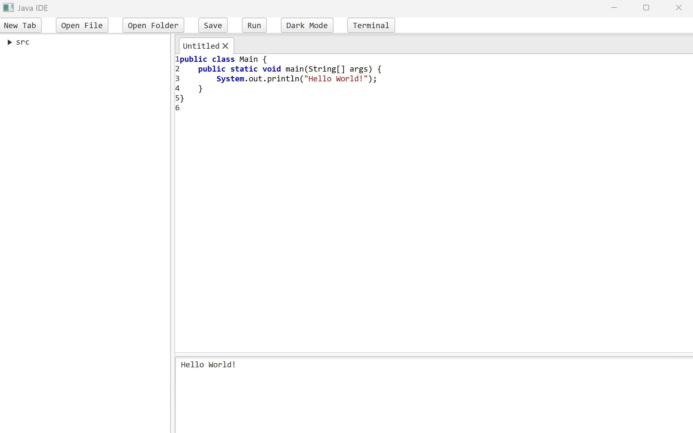
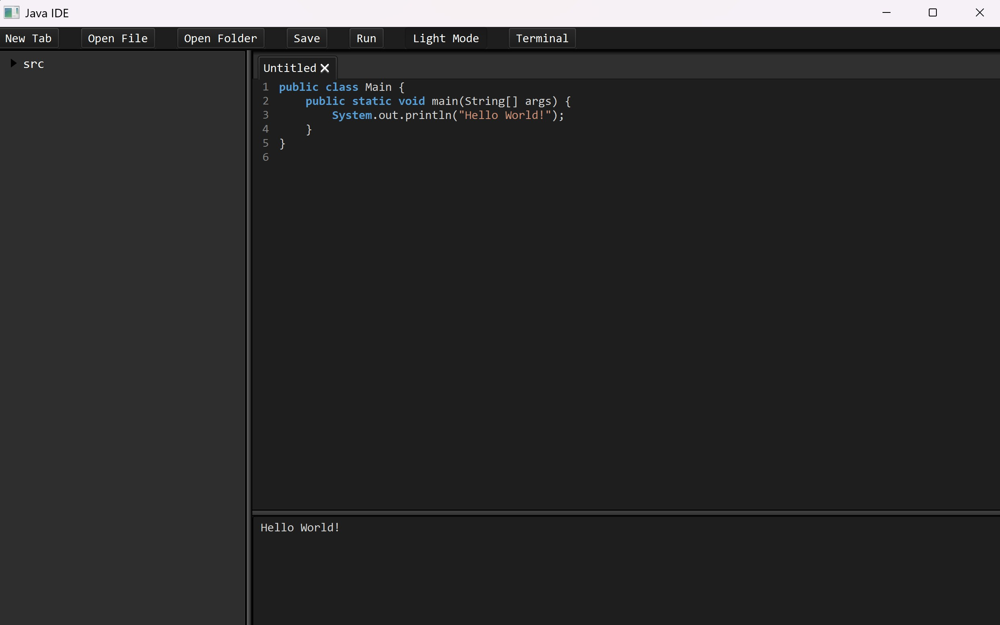
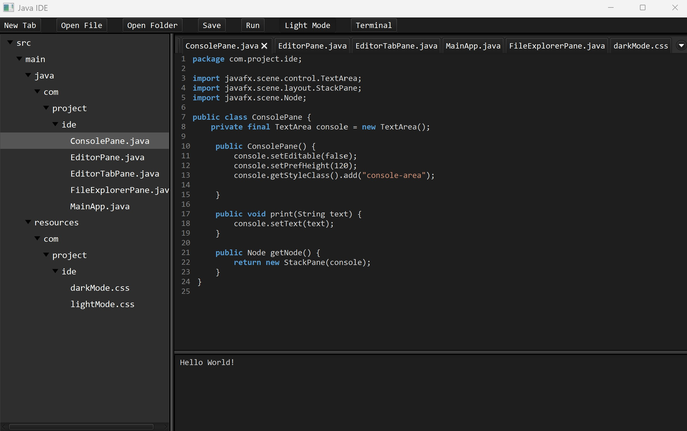

# Mini Java IDE
A mini java project that aims to create a working IDE like VS code

## API's and libraries imported
  JavaFX <br>
  Richtext <br>
  Java IO <br>
  css <br>  

  
## Install Guide

**Windows Install Guide:**
1) Clone project into your code editor
2) Open terminal, navigate to your local repository and make sure maven exists using: <br> <br>
  
   ```
   mvn -version
   ```
   
   <br>
   
3) Build the maven project :<br><br>
    
    ```
    mvn clean install
    ```
    
    <br>

   
   <br>
   
4) Run the application: <br><br>
    
    ```
    mvn clean javafx:run
    ```

   <br>


## IDE Features 
This project simulates the working of a java IDE with the following operations:
  - Editor to edit code <br>
  - Syntax highlighting for key words in the editor <br>
  - Console to display output <br>
  - Inbuilt compiler and debugger  <br>
  - Ability to create new tabs in the text editor <br>
  - File explorer that can be used to track and handle multiple java files <br>
  - Open local files and folders <br>
  - Run code on the current open editor <br>
  - Switch between light mode and dark mode <br>
  - Open terminal <br>

## IDE images

### IDE default look <br>
<br>



<br>

### IDE Dark Mode <br>
<br>


<br>

### Working image of IDE <br>
<br>


